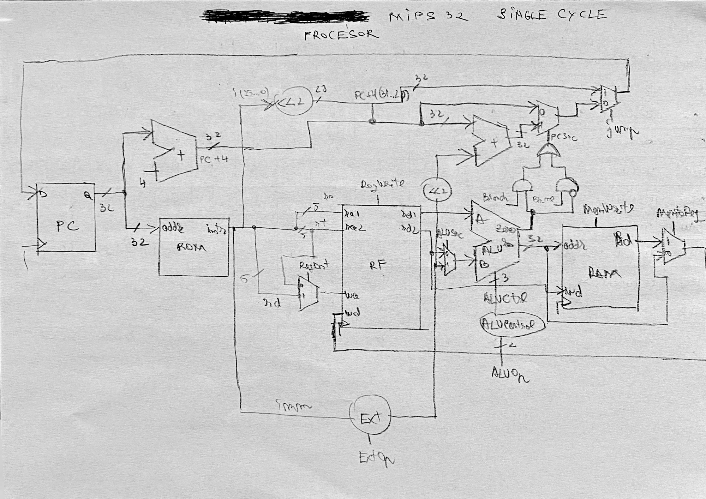
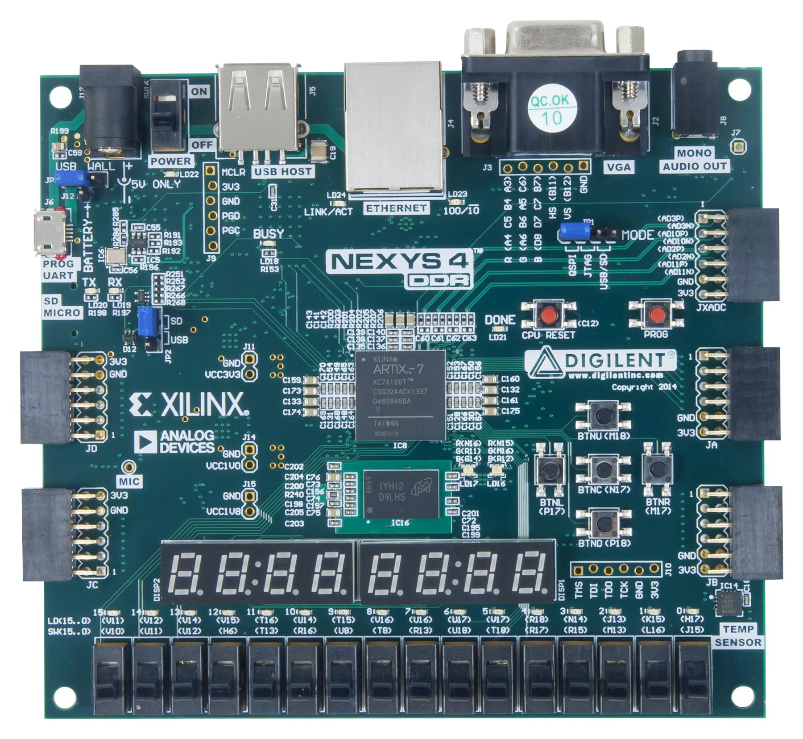
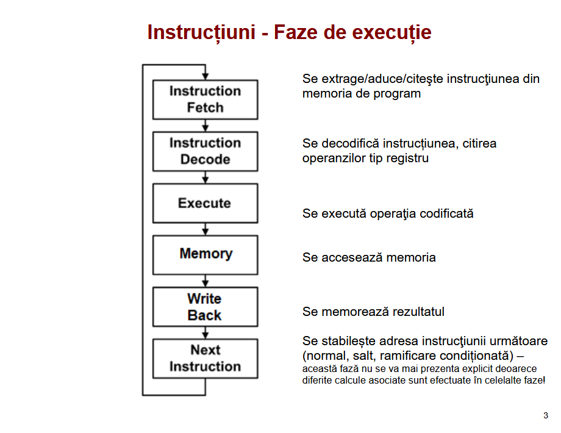
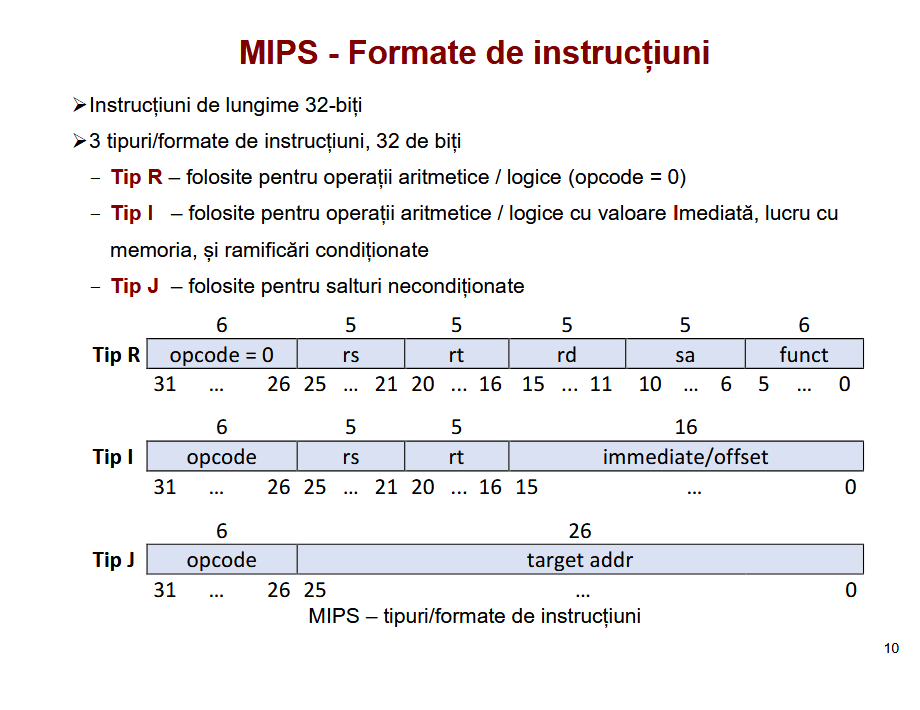

## MIPS 32 BIT architecture

The focus of my MIPS is to check if an array is sorted or not.

# Faze executie:

# Tipurile instructiunilor folosite in implementarea microprocesorului

## Components:

+ Instruction Fetch (IFetch)
+ Instruction Decode (ID)
+ Execution (EX)
+ Memory (MEM)
+ Write-Back (WB)
